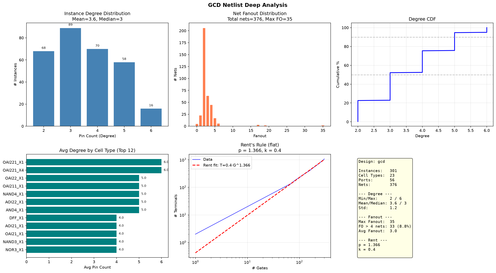

# GCD 深度网表分析

## 运行

```bash
python3.11 examples/deep_analysis.py
```

## 关键指标

| 指标 | 数值 | 说明 |
|------|------|------|
| Total Instances | 301 | 全部为 leaf cell |
| Cell Types | 23 | 标准单元库种类 |
| Ports | 56 | 顶层 IO |
| Nets | 376 | 内部连线 |

## Degree 分布

| | |
|---|---|
| 均值 / 中位 | 3.6 / 4 |
| 范围 | 1 - 6 |

每个门平均 3.6 个 pin，符合 Nangate45 标准单元特征（多为 2-4 输入门）。

## Fanout 分布

| | |
|---|---|
| 均值 / 最大 | 3.0 / 35 |
| FO > 4 的网线 | 约 10% |

有一条高扇出网线（FO=35），典型为时钟或复位信号。

## Rent's Rule

| 参数 | 数值 | 含义 |
|------|------|------|
| p | **1.366** | Rent 指数，反映连线复杂度 |
| k | 0.4 | 每个门平均对外终端数 |

p > 1 说明随着模块增大，对外连线增长快于线性。对于 301 个门的规模属于正常偏高范围。

---


