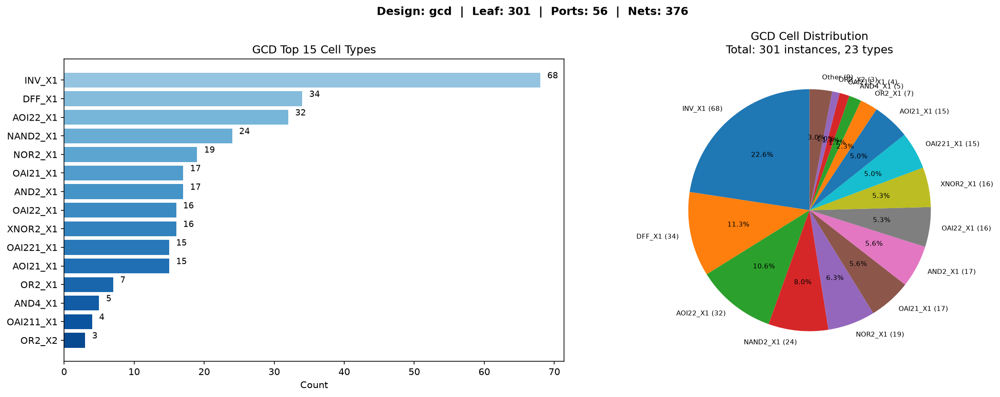

# GCD 网表分析

用 Dizo Python API 读 Verilog 网表，统计 Instance 分布并可视化。

## 运行

```bash
python3.11 examples/gcd_analysis.py
```

## 结果

| 指标 | 数值 |
|------|------|
| 总 Instance | 301 |
| Cell 类型 | 23 种 |
| Port | 56 |
| Net | 376 |

## 单元分布



类型集中度高：前三类（INV_X1、DFF_X1、AOI22_X1）占总量 44%，典型的组合逻辑+时序电路特征。
