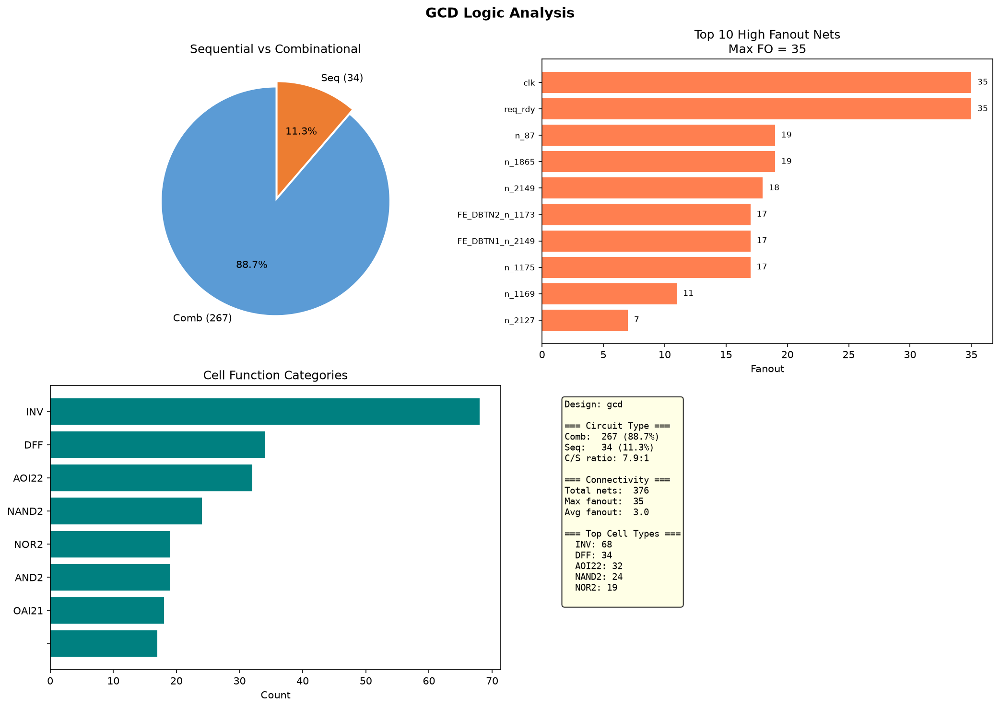

# GCD 逻辑分析

## 运行

```bash
python3.11 examples/logic_analysis.py
```

## 结果

| 指标 | 数值 |
|------|------|
| 组合逻辑 | 267 (88.7%) |
| 时序逻辑 (DFF) | 34 (11.3%) |
| 组合/时序比 | 7.9 : 1 |
| 最大扇出 | 35 |
| 平均扇出 | 3.0 |

## 单元功能类别

| 类别 | 数量 | 说明 |
|------|------|------|
| INV | 68 | 反相器 |
| DFF | 34 | 寄存器 |
| AOI22 | 32 | 与或非门 |
| NAND2 | 24 | 与非门 |
| NOR2 | 19 | 或非门 |

组合逻辑占绝对主导（88.7%），符合 GCD 算法特征（大量比较/减法组合逻辑，少量状态寄存器）。


