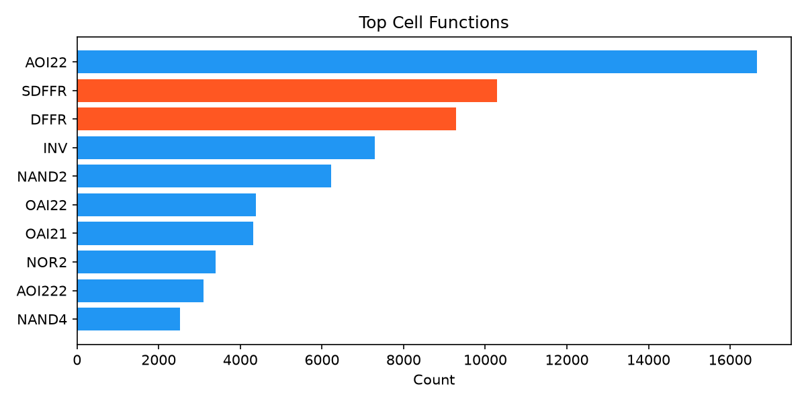

# Ariane133 网表分析

Ariane RISC-V 64 位处理器核心。

## 基础统计

| 指标 | 数值 |
|------|------|
| Instance | 83,924 |
| Cell 类型 | 77 |
| Port | 500 (IN:221 OUT:279) |
| Net | 109,590 |

  

## 连接度

| 指标 | 数值 |
|------|------|
| Degree 均值 | 4.6 |
| Degree 范围 | 2–44 |
| Fanout 均值 | — |
| Fanout 最大 | 19,629 |

## Rent's Rule

| 参数 | 数值 |
|------|------|
| **p** | **1.377** |
| k | 0.06 |

## 设计特征

- **RISC-V 核心**：84K 门、77 种单元、500 IO 口，典型嵌入式处理器规模
- **Degree 均值 4.6**：高于 Nangate45 平均（3.6），说明使用了更多复杂门（AOI/OAI），时序优化结果
- **Fanout 极大**：最大 19,629，复杂时钟树或全局复位
- **Rent p=1.377**：在当前 Benchmark 中最高，RISC-V 控制路径复杂、互联不规则
- **无时序单元**：netlist 中无 DFF/SDFF，可能综合时被优化或使用 latch-based 设计
