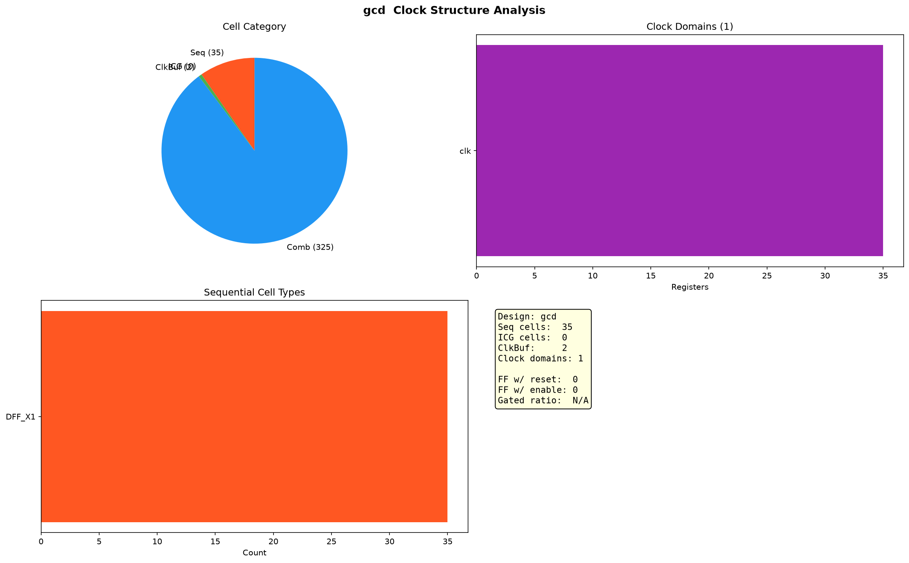

# GCD 时钟结构分析

> 独立于网表结构分析（`gcd_report.md`）。

## 单元分类

| 类别 | 数量 | 占比 |
|------|-----:|------|
| 时序单元（DFF/Latch） | 35 | 9.7% |
| 时钟门控（ICG） | 0 | — |
| 时钟 buffer/inverter | 2 | 0.6% |
| 组合逻辑 | 325 | 89.8% |

## 时序单元类型

| Cell | 数量 |
|------|-----:|
| DFF_X1 | 35 |

## 时钟域

| 时钟根 | 寄存器数 |
|--------|--------:|
| clk | 35 |

单时钟设计，35 个寄存器全部由 `clk` 驱动。

## 时钟门控

无 ICG 单元（未做时钟门控）。

## 复位/使能

| 属性 | 数量 |
|------|-----:|
| 带复位寄存器 | 0 / 35 |
| 带使能/scan 寄存器 | 0 / 35 |

DFF_X1 为无复位、无使能的裸 D 触发器，GCD 无异步复位。

## 时钟 buffer 层级

2 个 CLKBUF_X1 构成单级时钟缓冲树，从 `clk` 扇出到 35 个寄存器。

## 总结

GCD 时钟结构极简：单时钟域 `clk`，35 个无复位 DFF_X1，2 个 CLKBUF 缓冲，无时钟门控、无 scan。典型教学级设计特征。
