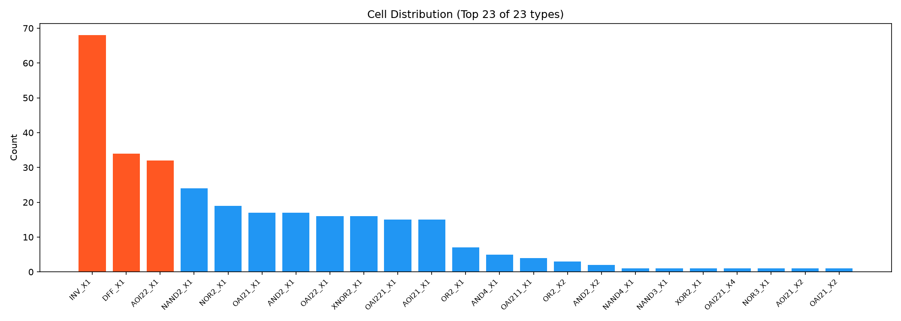
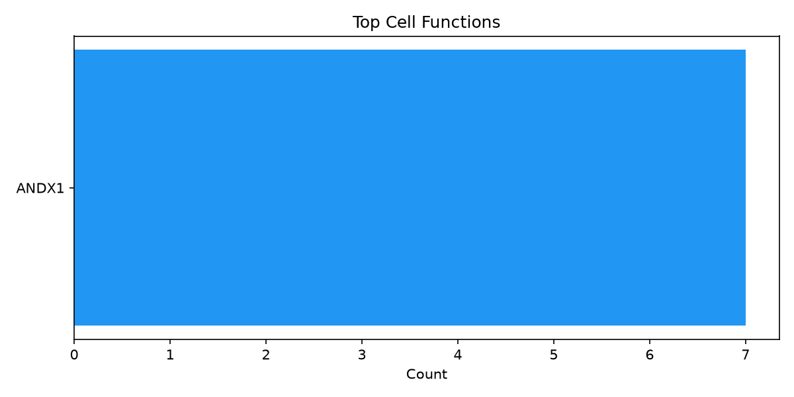
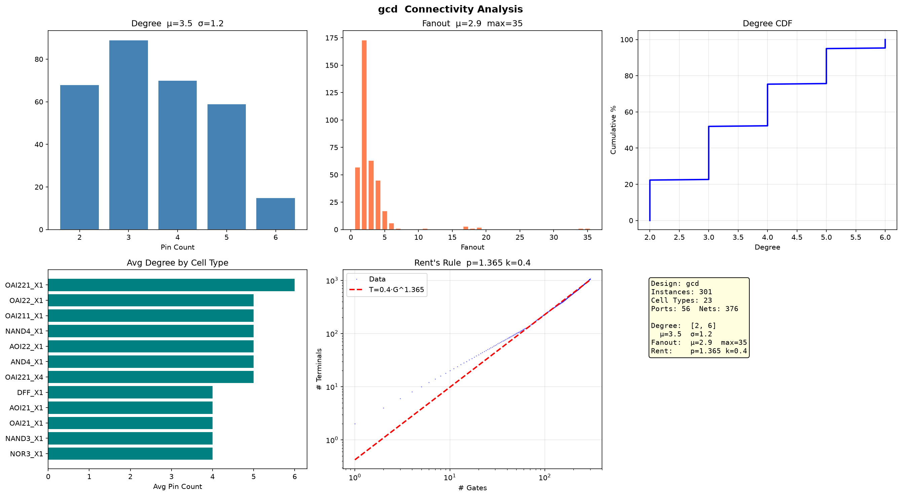

# GCD 网表分析报告

## 运行

```bash
python3.11 analysis/netlist_profiler.py <gcd.v>
```

## 基础统计

| 指标 | 数值 |
|------|------|
| 总 Instance | 301 |
| Cell 类型 | 23 种 |
| Port | 56 |
| Net | 376 |



---

## 功能分类



---

## 连接度分析

| 指标 | 数值 |
|------|------|
| Degree 均值 | 3.5 (σ=1.2) |
| Degree 范围 | 2–6 |
| Fanout 均值 | — |
| Fanout 最大 | 35 |

---

## Rent's Rule

| 参数 | 数值 |
|------|------|
| **p** | **1.365** |
| k | 0.42 |



---

## 总结

GCD 电路：301 门中等规模，组合逻辑为主，Rent p=1.365 布线复杂度正常，有一条高扇出时钟/复位线（FO=35）。
