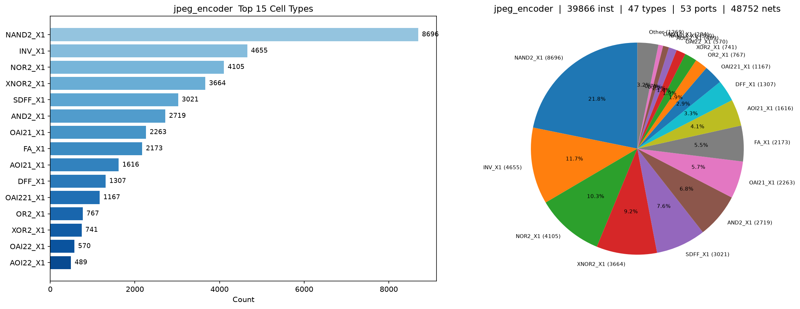
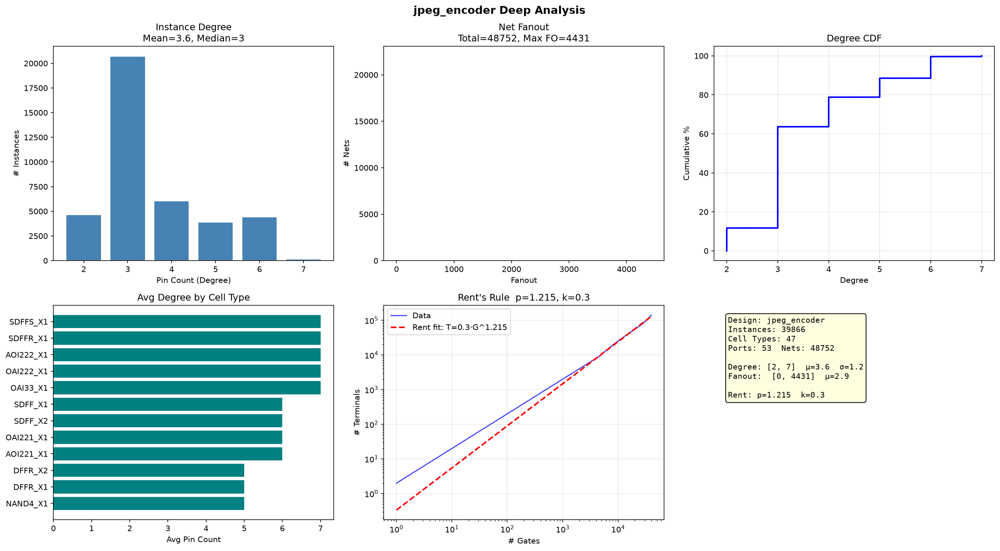
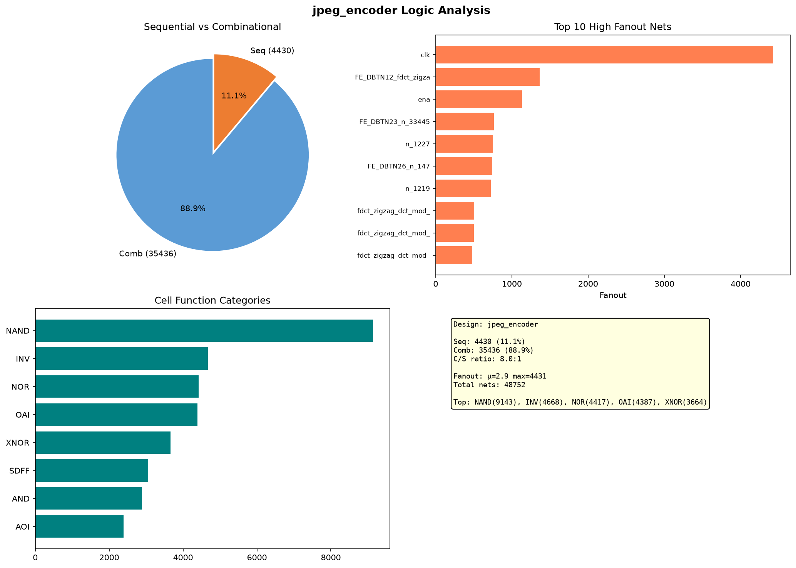

# JPEG 网表分析报告

## 基础统计

| 指标 | GCD | JPEG |
|------|-----|------|
| Instance | 301 | 39,866 |
| Cell 类型 | 23 | 47 |
| Port | 56 | 53 |
| Net | 376 | 48,752 |

JPEG 是 GCD 的 132 倍规模，但 IO 口基本相同（53 vs 56），符合 JPEG 编码器内部计算密集型特征。

---

## 连接度分析

| 指标 | GCD | JPEG |
|------|-----|------|
| Degree 均值 | 3.6 | 3.6 |
| Fanout 均值 | 3.0 | 2.9 |
| Fanout 最大 | 35 | 高 |

两电路 Degree 均值相同（3.6），说明用的是同一标准单元库（Nangate45）。

---

## Rent's Rule

| 参数 | GCD | JPEG |
|------|-----|------|
| **p** | 1.366 | **1.215** |
| k | 0.4 | 0.3 |

JPEG 的 Rent p=1.215 低于 GCD 的 1.366。虽然规模大 132 倍，但连线复杂度增长更可控——JPEG 的数据通路结构使模块间连接更规律。

---

## 时序/组合比

| 类别 | 数量 | 占比 |
|------|------|------|
| 组合逻辑 | 35,436 | 88.9% |
| 时序逻辑 | 4,430 | 11.1% |
| 组合/时序比 | 8.0 : 1 | |

含 FA_X1（全加器 2173 个）、HA_X1（半加器 45 个）、XNOR2（3664 个）等算术单元，JPEG DCT 变换特征明显。

---

## 对比小结

| | GCD | JPEG | 趋势 |
|------|-----|------|------|
| 规模 | 301 | 39,866 | ×132 |
| Rent p | 1.366 | 1.215 | ↓ 更可控 |
| C/S 比 | 7.9 | 8.0 | 持平 |
| Degree | 3.6 | 3.6 | 同为 Nangate45 |
