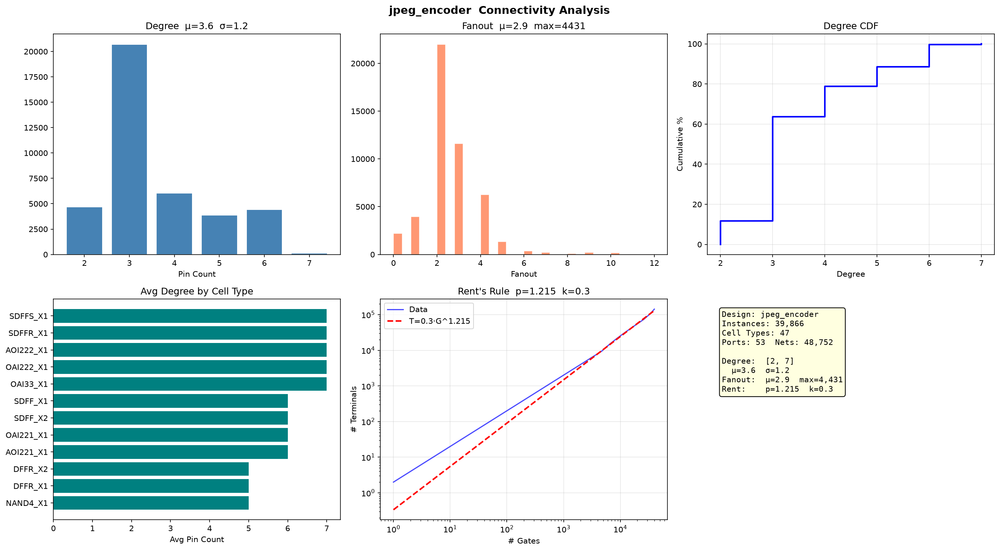

# JPEG 网表分析报告

## 基础统计

| 指标 | 数值 |
|------|------|
| Instance | 39,866 |
| Cell 类型 | 47 种 |
| Port | 53 |
| Net | 48,752 |

---

## 连接度分析

| 指标 | 数值 |
|------|------|
| Degree 均值 | 3.6 |
| Fanout 均值 | 2.9 (P95=5) |

---

## Rent's Rule

| 参数 | 数值 |
|------|------|
| **p** | **1.215** |
| k | 0.3 |

---

## 时序/组合比

| 类别 | 数量 | 占比 |
|------|------|------|
| 组合逻辑 | 35,436 | 88.9% |
| 时序逻辑 | 4,430 | 11.1% |
| 组合/时序比 | 8.0 : 1 |

含全加器 FA_X1 (2173)、半加器 HA_X1 (45)、异或门 XNOR2 (3664)，JPEG DCT 变换特征明显。

---

## 总结

39,866 门规模，47 种标准单元，组合逻辑占 88.9%。Rent p=1.215 连线复杂度适中，包含大量算术单元（FA/HA/XNOR），符合 JPEG 编码器数据通路特征。
