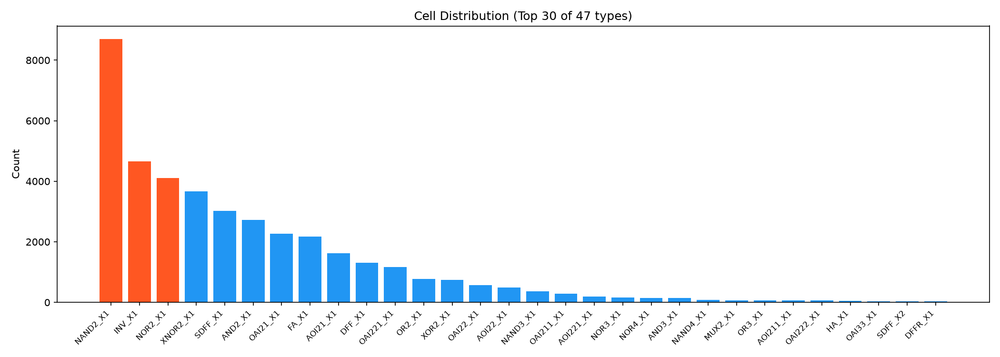
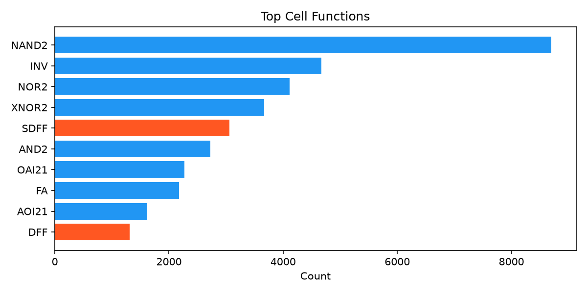
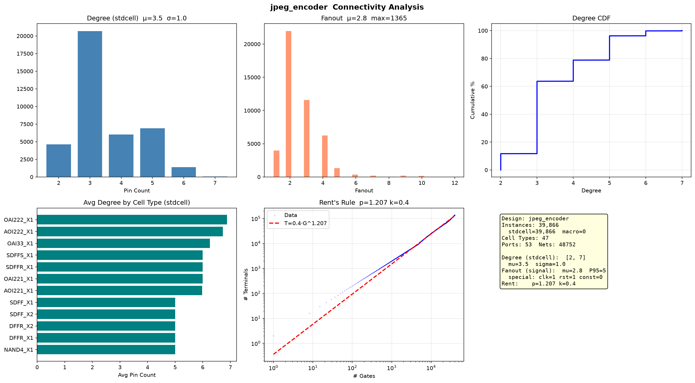

# JPEG 网表分析报告

## 基础统计

| 指标 | 数值 |
|------|------|
| Instance | 39,866 |
| Cell 类型 | 47 种 |
| Port | 53 (IN:22 OUT:31) |
| Net | 48,752 |

---

## 功能分类

---

## 连接度分析

| 指标 | 数值 |
|------|------|
| Degree 均值（标准单元） | 3.5 (σ=1.0) |
| Degree 范围（标准单元） | 2–7 |
| Fanout 均值（信号网） | 2.8 (P95=5) |
| Fanout 最大（信号网） | 1365 |

## 宏单元

无（纯标准单元设计）。

## 特殊网（时钟/复位/常量）

| 类型 | 网名 | Fanout |
|------|------|-------:|
| clock | clk | 4,430 |
| reset | rst | 65 |

> 另有高扇出信号网：`fdct_zigzag_dct_mod_ddgo` (FO=1365)、`ena` (FO=1130)，为 DCT 模块的全局数据使能/广播信号，综合器未做 buffer 树。

---

## Rent's Rule

| 参数 | 数值 |
|------|------|
| **p** | **1.207** |
| k | 0.36 |

---

## 时序/组合比（按功能分类推断）

| 类别 | 数量 | 占比 |
|------|------|------|
| 组合逻辑 | 35,436 | 88.9% |
| 时序逻辑 (SDFF+DFF) | 4,328 | 10.9% |
| 组合/时序比 | 8.2 : 1 |

含全加器 FA_X1 (2173)、异或门 XNOR2 (3664) + XOR2 (741)，JPEG DCT 变换特征明显。

---

## 总结

39,866 门规模，47 种标准单元，组合逻辑占 88.9%。Rent p=1.207 连线复杂度适中（数据通路型），含大量算术单元（FA/XNOR/XOR），符合 JPEG 编码器 DCT 数据通路特征。时钟网 clk 驱动 4,430 负载，DCT 模块存在全局广播信号（FO>1000），需关注 buffer 插入。
