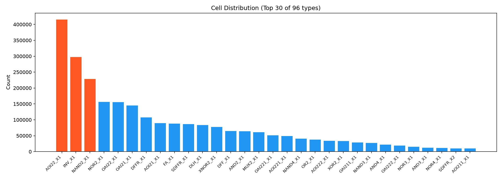
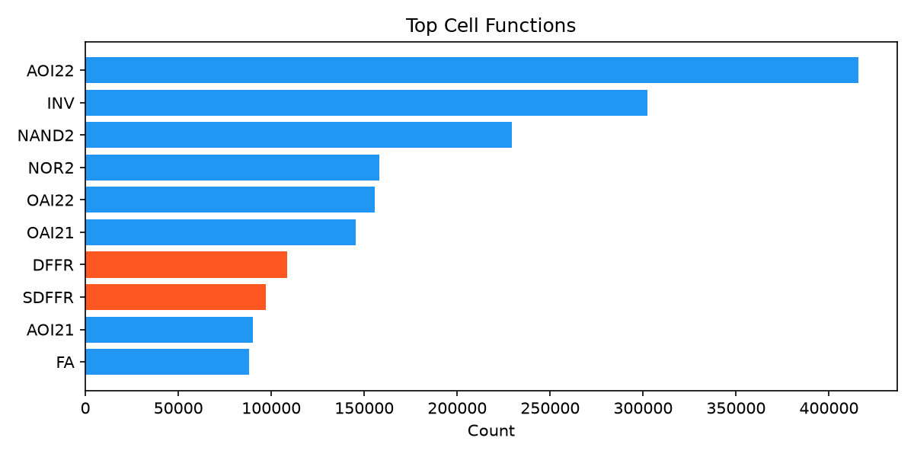
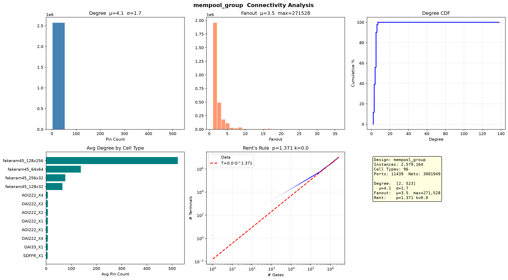

# MemPool Group 网表分析

MemPool 众核处理器，256 个 Snitch RISC-V 核心。

## 基础统计

| 指标 | 数值 |
|------|------|
| Instance | 2,579,164 |
| Cell 类型 | 96 |
| Port | 11,439 (IN:5862 OUT:5577) |
| Net | 3,001,949 |

  

## 连接度

| 指标 | 数值 |
|------|------|
| Degree 均值 | 4.1 (σ=1.7) |
| Degree 范围 | 2–523 |
| Fanout 均值 | — |
| Fanout 最大 | 271,528 |

## Rent's Rule

| 参数 | 数值 |
|------|------|
| **p** | **1.371** |
| k | 0.02 |

## 设计特征

- **当前最大规模**：258 万门，超过 NVDLA（223 万）
- **众核特征**：11,439 个 IO 口（5862 IN + 5577 OUT），256 核互联矩阵
- **Degree σ=1.7**：核心间差异小（均质众核），远低于 superblue1（σ=4.7）
- **Fanout 极大**：271,528，众核共享总线/NoC 导致
- **Rent p=1.371**：当前最高，众核互联复杂度大
