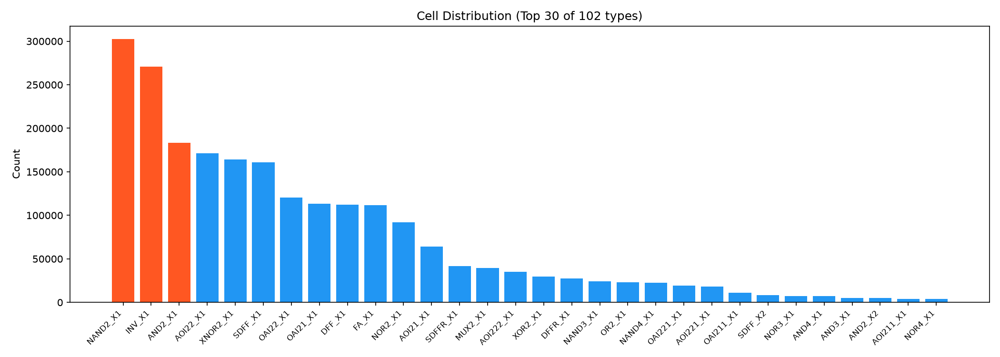
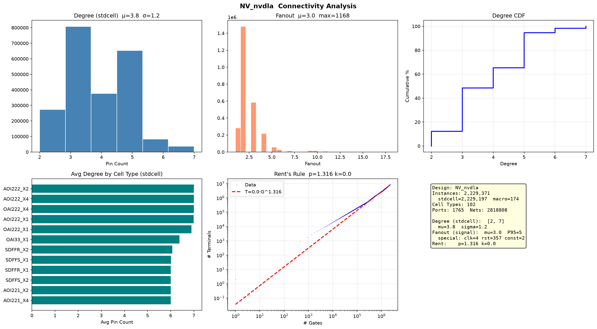

# NVDLA 网表分析报告

> NVIDIA Deep Learning Accelerator — 开源深度学习推理加速器

## 基础统计

| 指标 | 数值 |
|------|------|
| Instance | 2,229,371 |
| Cell 类型 | 102 种 |
| Port | 1,765 (IN:820 OUT:945) |
| Net | 2,818,808 |

## 连接度分析

| 指标 | 数值 |
|------|------|
| Degree 均值（标准单元） | 3.8 (σ=1.1) |
| Degree 范围（标准单元） | 2–7 |
| Fanout 均值（信号网） | 3.0 (P95=5) |
| Fanout 最大（信号网） | 1,168 |

## 宏单元（SRAM）

> 174 个宏单元，15 种类型，构成卷积缓冲/SRAM 阵列。

| 类型 | 数量 | 平均 Degree |
|------|-----:|-----------:|
| fakeram45_512x256 | 64 | 525 |
| fakeram45_64x256 | 50 | 517 |
| fakeram45_256x258 | 12 | 527 |
| fakeram45_64x116 | 16 | 242 |
| ... (15 种) | ... | ... |

## 特殊网（时钟/复位/常量）

> 363 条特殊网，单独分析。

| 类型 | 网名 | Fanout |
|------|------|-------:|
| clock | dla_core_clk | 355,370 |
| reset | nvdla_core_rstn | 38,747 |
| constant | LOGICAL_1 | 35,802 |
| reset | u_partition_c_nvdla_core_rstn | 14,224 |
| ... | ... | ... |

## Rent's Rule

| 参数 | 数值 |
|------|------|
| **p** | **1.316** |
| k | 0.04 |

## Top 10 单元

| Cell | 数量 | 占比 | 功能推断 |
|------|------|------|----------|
| NAND2_X1 | 302,441 | 13.6% | 通用逻辑 |
| INV_X1 | 270,743 | 12.1% | 反相/缓冲 |
| AND2_X1 | 183,560 | 8.2% | 与门 |
| AOI22_X1 | 171,419 | 7.7% | 复杂门（MAC 控制） |
| XNOR2_X1 | 164,296 | 7.4% | 比较器 / PE 阵列 |
| SDFF_X1 | 160,861 | 7.2% | 流水线寄存器（带 Scan） |
| OAI22_X1 | 120,670 | 5.4% | 复杂门 |
| OAI21_X1 | 113,519 | 5.1% | 复杂门 |
| DFF_X1 | 112,200 | 5.0% | 寄存器 |
| FA_X1 | 111,495 | 5.0% | 全加器（MAC 计算） |

## 设计特征

- **MAC 阵列**：111K FA_X1 全加器（5.0%），配合 XNOR2 构成乘法累加单元，是卷积计算核心
- **深流水线**：273K 寄存器（SDFF+DFF），流水线级数深
- **生产级 DFT**：SDFF 占时序单元 59%，Scan chain 规模大
- **174 个 SRAM 宏**：fakeram45_512x256（degree≈525）构成卷积数据缓冲
- **时钟树**：dla_core_clk 驱动 355K 负载，复位 nvdla_core_rstn 驱动 38K
- **Rent p=1.316**：数据通路为主，互连复杂度中等
