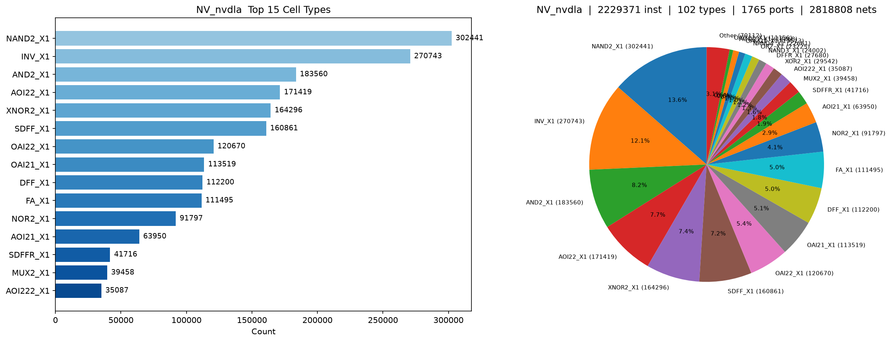
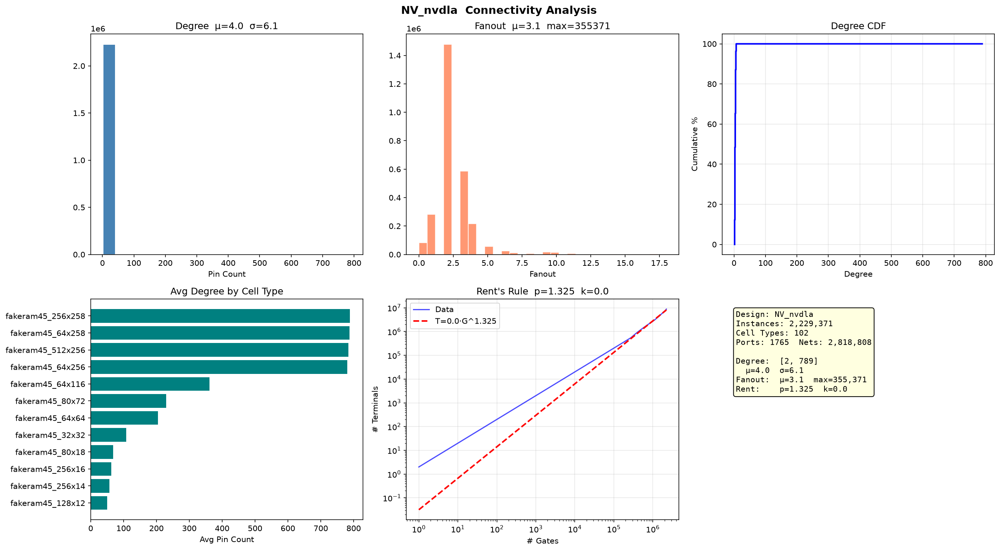
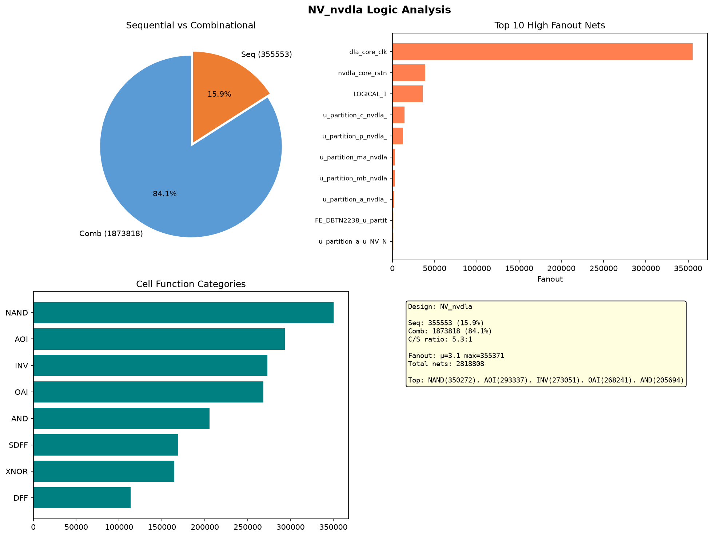

# NVDLA 网表分析报告

> NVIDIA Deep Learning Accelerator — 开源深度学习推理加速器

## 基础统计

| 指标 | 数值 |
|------|------|
| Instance | 2,229,371 |
| Cell 类型 | 102 种 |
| Port | 1,765 |
| Net | 2,818,808 |

## 连接度分析

| 指标 | 数值 |
|------|------|
| Degree 均值 | 4.0 |
| Fanout 均值 | 3.1 (P95=5) |

## Rent's Rule

| 参数 | 数值 |
|------|------|
| **p** | **1.325** |
| k | 0.0 |

## Top 10 单元

| Cell | 数量 | 占比 | 功能推断 |
|------|------|------|----------|
| NAND2_X1 | 302,441 | 13.6% | 通用逻辑 |
| INV_X1 | 270,743 | 12.1% | 反相/缓冲 |
| AND2_X1 | 183,560 | 8.2% | 与门 |
| AOI22_X1 | 171,419 | 7.7% | 复杂门（MAC 控制） |
| XNOR2_X1 | 164,296 | 7.4% | 比较器 / PE 阵列 |
| SDFF_X1 | 160,861 | 7.2% | 流水线寄存器（带 Scan） |
| OAI22_X1 | 120,670 | 5.4% | 复杂门 |
| OAI21_X1 | 113,519 | 5.1% | 复杂门 |
| DFF_X1 | 112,200 | 5.0% | 寄存器 |
| FA_X1 | 111,495 | 5.0% | 全加器（MAC 计算） |

## Runtime

| 脚本 | GCD (301) | JPEG (40K) | NVDLA (2.2M) |
|------|-----------|------------|---------------|
| `count_instances.py` | 0.5s | 1.5s | ~60s |
| `cell_distribution.py` | 1.2s | 2.3s | 75s |
| `connectivity_analysis.py` | 2.1s | 4.7s | 155s |
| `seq_comb_analysis.py` | 1.2s | 3.3s | 149s |

## 时序/组合比

| 类别 | 数量 | 占比 |
|------|------|------|
| 组合逻辑 | 1,873,818 | 84.1% |
| 时序逻辑 | 355,553 | 15.9% |
| 组合/时序比 | 5.3 : 1 | |

## 设计特征

- **MAC 阵列**：111K FA_X1 全加器（5.0%），配合 XNOR2 构成乘法累加单元，是卷积计算核心
- **深流水线**：273K 寄存器（SDFF+DFF），流水线级数深，时序收敛是主要挑战
- **生产级 DFT**：SDFF 占时序单元的 59%，Scan chain 规模大
- **Rent p=1.325**：控制+数据混合型，互连复杂度中等偏高
- **Degree 均值 4.0**：高于 GCD/JPEG 的 3.6，门级复杂度更高
