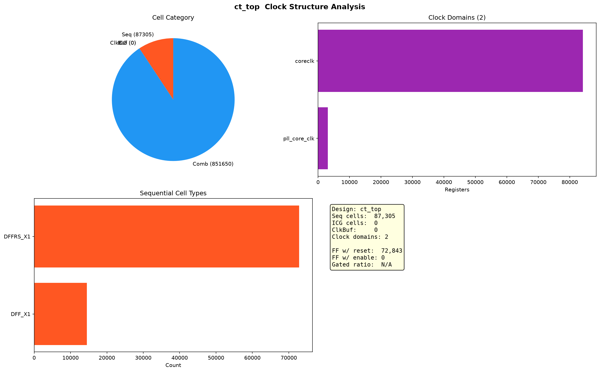

# OpenC910 时钟结构分析

> 独立于网表结构分析（`openc910_report.md`）。

## 单元分类

| 类别 | 数量 | 占比 |
|------|-----:|------|
| 时序单元（DFF/Latch） | 87,305 | 9.3% |
| 时钟门控（ICG 专用单元） | 0 | — |
| 时钟 buffer/inverter（CLKBUF 专用） | 0 | — |
| 组合逻辑 | 851,650 | 90.7% |

> 注：无 CLKBUF/ICG 专用命名单元，时钟树由通用 `INV_X1` 反相器（129,319 个）构建，时钟门控可能由 latch + 组合逻辑实现。精确区分需 Liberty 的 `is_clock` API（见需求 `notes/lib_pin_api_requirement.md`）。

## 时序单元类型

| Cell | 数量 | 说明 |
|------|-----:|------|
| DFFRS_X1 | 72,843 | 带异步复位 RN + set SN + scan SE/SI |
| DFF_X1 | 14,462 | 无复位裸 D 触发器 |

## 时钟域

| 时钟根 | 寄存器数 | 占比 |
|--------|--------:|------|
| coreclk | 84,199 | 96.4% |
| pll_core_clk | 3,106 | 3.6% |

双时钟设计：主时钟 `coreclk` 驱动核心逻辑，PLL 时钟 `pll_core_clk` 驱动 PLL 相关寄存器。

## 复位/使能

| 属性 | 数量 |
|------|-----:|
| 带复位寄存器 | 72,843 / 87,305 (83.4%) |
| 带使能/scan 寄存器 | 0 / 87,305 |

> 注：DFFRS_X1 含 SE/SI 引脚，但 scan 使能/数据网可能为常量或未连，识别为 0 属正常。

## 时钟门控

无 ICG 专用单元。openc910 网表中的 `gateclk_sel` 信号（见网表分析特殊网）表明存在时钟门控逻辑，但由 latch + 组合逻辑实现，非专用 ICG cell。

## 总结

openc910 时钟结构：双时钟域（coreclk 主时钟 + pll_core_clk PLL 时钟），87K 寄存器中 83% 带异步复位（DFFRS），时钟树用通用 INV 反相器构建（无专用 CLKBUF），时钟门控用组合逻辑实现（无专用 ICG）。
