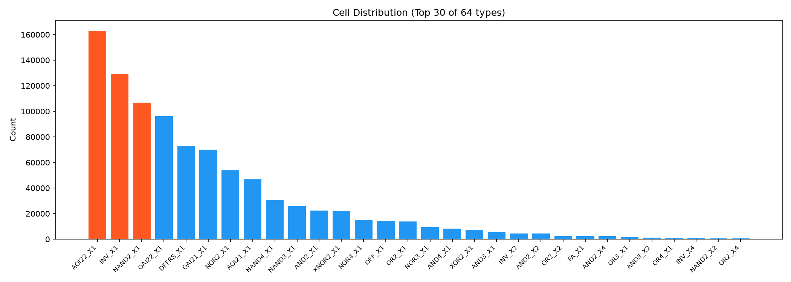
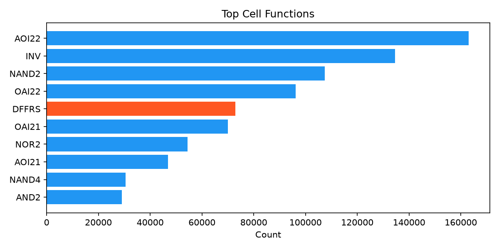
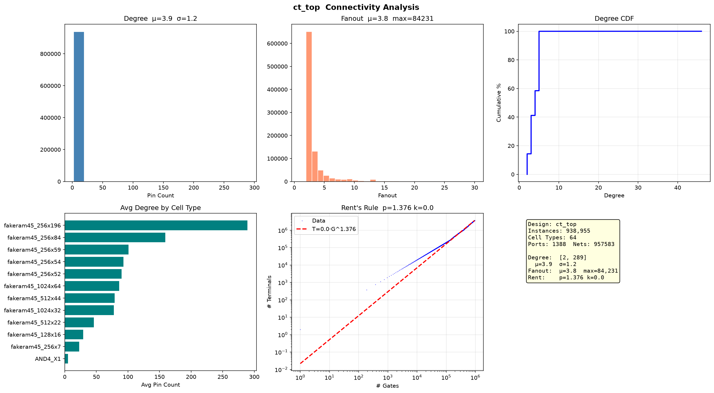

# OpenC910 网表分析

玄铁 C910 — 高性能 RISC-V 64 位处理器核心。

## 基础统计

| 指标 | 数值 |
|------|------|
| Instance | 938,955 |
| Cell 类型 | 64 |
| Port | 1,388 (IN:582 OUT:806) |
| Net | 957,583 |

  

## 连接度

| 指标 | 数值 |
|------|------|
| Degree 均值 | 3.9 (σ=1.2) |
| Degree 范围 | 2–289 |
| Fanout 均值 | 3.8 (P95=9) |
| Fanout 最大 | 84,231 |

## Rent's Rule

| 参数 | 数值 |
|------|------|
| **p** | **1.376** |
| k | 0.02 |

## 设计特征

- **高性能 RISC-V**：94 万门、64 种单元，比 Ariane133（8.4 万门）大 10 倍
- **σ=1.2**：均质标准单元设计，无大型宏单元，与 superblue1（σ=4.7）形成鲜明对比
- **Rent p=1.376**：与 Ariane133（1.377）几乎一致——不同规模、不同工艺的 RISC-V 核心具有相同的拓扑复杂度
- **Fanout 大**：max 84,231，复杂时钟树/复位网络
