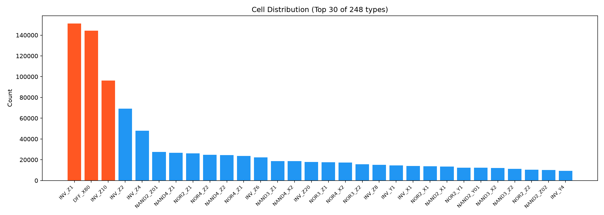
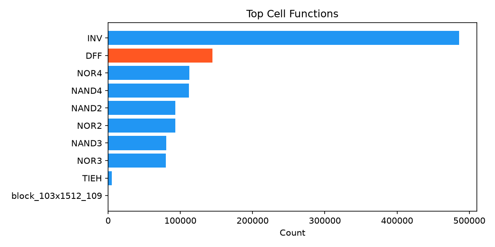
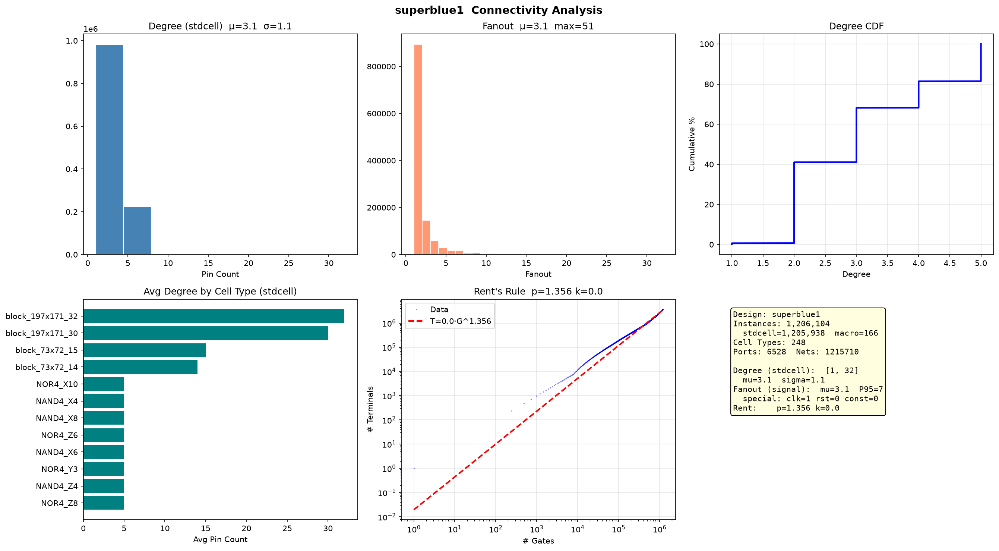

# superblue1 网表分析

ICCAD 2015 竞赛 Benchmark，120 万门工业级设计。

## 基础统计

| 指标 | 数值 |
|------|------|
| Instance | 1,206,104 |
| Cell 类型 | 248 |
| Port | 6,528 (IN:3037 OUT:3491) |
| Net | 1,215,710 |

  

## 连接度

| 指标 | 数值 |
|------|------|
| Degree 均值（标准单元） | 3.1 (σ=2.4) |
| Degree 范围（标准单元） | 1–32 |
| Fanout 均值（信号网） | 3.1 (P95=7) |
| Fanout 最大（信号网） | 51 |

## 宏单元（RAM/ROM/IP）

> 166 个宏单元，38 种类型，单独分析。

| 类型 | 数量 | 平均 Degree |
|------|-----:|-----------:|
| block_103x1512_109 | 24 | 108 |
| block_103x1629_118 | 24 | 117 |
| block_252x2070_144 | 24 | 143 |
| block_416x441_118 | 14 | 118 |
| ... (38 种) | ... | ... |

## 特殊网（时钟/复位/常量）

| 类型 | 网名 | Fanout |
|------|------|-------:|
| clock | iccad_clk | 7,213 |

## Rent's Rule

| 参数 | 数值 |
|------|------|
| **p** | **1.356** |
| k | 0.02 |

## 设计特征

- **工业级规模**：120 万门、248 种单元，远超学术 Benchmark
- **IO 密集型**：6528 个端口，输出多于输入（3491 vs 3037），数据通路特征
- **异构设计**：166 个宏单元（38 种 block），Degree 方差大（σ=2.4）
- **时钟结构简单**：仅 iccad_clk 一个时钟，驱动 7,213 负载
- **Rent p=1.356**：互联复杂度与 GCD 相当，但规模差 4000 倍
