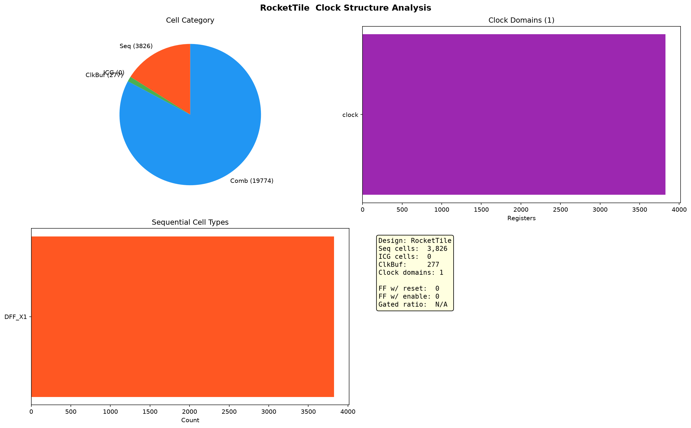

# tinyRocket 时钟结构分析

> 独立于网表结构分析。tinyRocket 为 Rocket Chip 精简版，RISC-V 单核。

## 单元分类

| 类别 | 数量 | 占比 |
|------|-----:|------|
| 时序单元（DFF/Latch） | 3,826 | 16.0% |
| 时钟门控（ICG） | 0 | — |
| 时钟 buffer/inverter | 277 | 1.2% |
| 组合逻辑 | 19,774 | 82.8% |

## 时序单元类型

| Cell | 数量 |
|------|-----:|
| DFF_X1 | 3,826 |

## 时钟域

| 时钟根 | 寄存器数 |
|--------|--------:|
| clock | 3,826 |

单时钟设计，3826 个寄存器全部由 `clock` 驱动。

## 时钟 buffer 层级

277 个 CLKBUF_X1 构成时钟缓冲树，从 `clock` 扇出到 3826 个寄存器，平均每个 buffer 驱动约 14 个寄存器（或为多级缓冲树）。

## 时钟门控

无 ICG 专用单元。

## 复位/使能

| 属性 | 数量 |
|------|-----:|
| 带复位寄存器 | 0 / 3,826 |
| 带使能/scan 寄存器 | 0 / 3,826 |

DFF_X1 为无复位裸 D 触发器，tinyRocket 无异步复位。

## 总结

tinyRocket 时钟结构：单时钟域 `clock`，3826 个无复位 DFF_X1，277 个 CLKBUF_X1 构成时钟缓冲树（约 14 寄存器/buffer），无时钟门控、无 scan。相比 openc910（INV 构建时钟树），tinyRocket 使用专用 CLKBUF，时钟树结构更规整。
